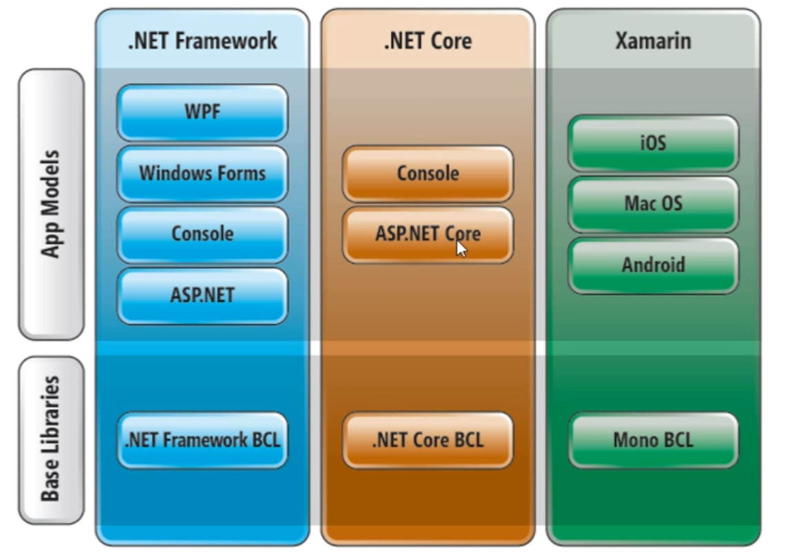

# CSHAP

## Informações
- C# -> Linguagem
- .NET -> Especificação, podem ser utilizadas por várias linguagens
    - BCL
        - Bibliotecas
    - CLR
        - Máquina virtual
        - Possui Grbage collection
- .NET Standard
    - Implementações
        - .NET Framework
            - Só para Windows
        - Mono
            - Multiplataforma
        - Xamarin
            - Mobile
        - .NET Core
            - Multiplataforma, WEB e Nuvem



> Identação: VS 2022: CTRL+K+D
> Salvar: CTRL+F5


### Conenções
- `Camel Case`: lastName (parâmetros de métodos, variáveis dentro de métodos)
- `Pascal Case`: LastName (namespaces, classe, properties e métodos)
- `Padrão` _lastName (atributos "internos" da classe)

### DEBBUG
- F9 na linha para marcar o breakpoint
- F5 pra iniciar o debbug
- F10 executa o próximo passo
- F11 - executar um passo (entra na função)
- SHIFT+F11 - sair do método em execução
- SHIFT+F5 - parar debug
## Comandos Base
```
dotnet --version
dotnet new
dotnet new --list
dotnet new webapi -o demoapi2 --framework net6.0
dotnet run
dotnet --list-sdks
dotnet new console --framework net6.0
dotnet new console -n ApplicationBase --framework net6.0
```
### AVISO IMPORTANTE SOBRE CONVERSÃO DE STRING
- Na aula fazemos a conversão de string para enumeração assim:
```
OrderStatus os = Enum.Parse<OrderStatus>("Delivered");
```
- Mas, dependendo da versão do compilador C#, isso pode dar problema. Se for o caso, por favor tente deste jeito:
```
OrderStatus os = (OrderStatus)Enum.Parse(typeof(OrderStatus), "Delivered");
```
Se mesmo assim ainda tiver dando erro, há ainda uma terceira forma:
```
OrderStatus os;
Enum.TryParse("Delivered", out os);
```


- [Baixar .NET 6.0](https://dotnet.microsoft.com/pt-br/download/dotnet/6.0)

## IDE
- [Visual Studio](https://visualstudio.microsoft.com/pt-br/)

